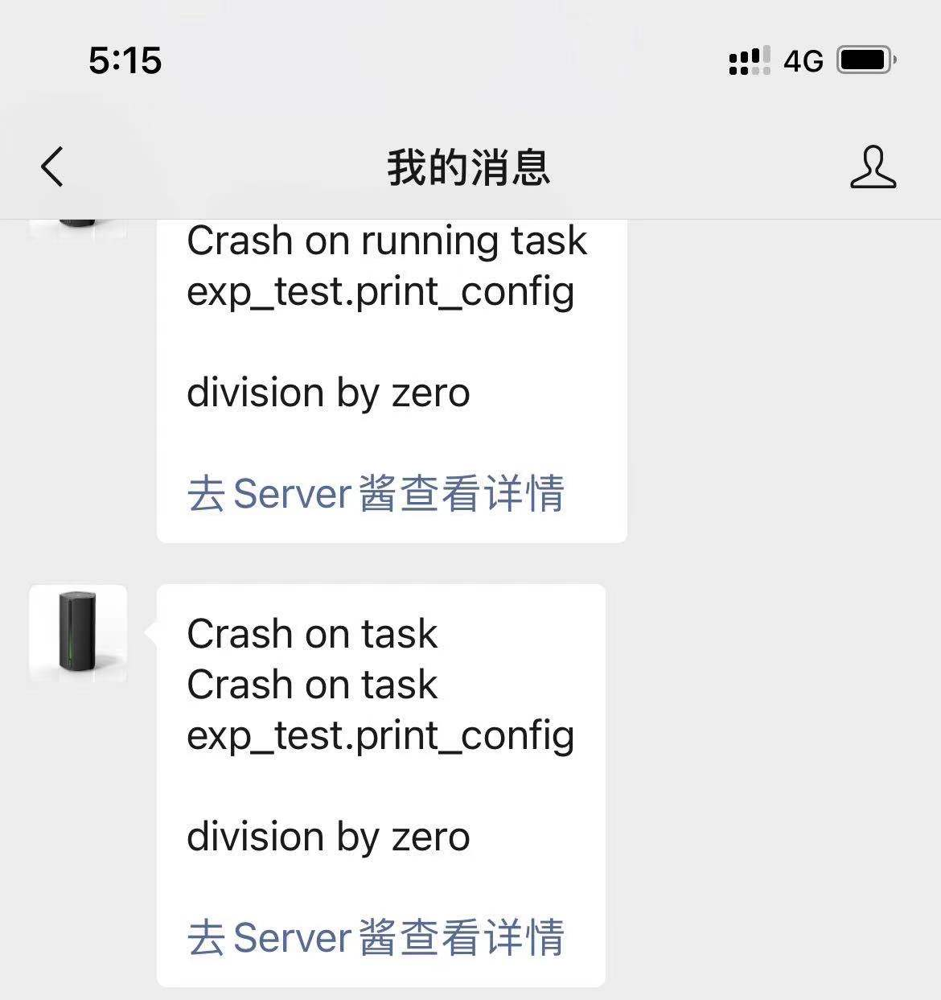

# python-dlcr-framework

A python deep learning configuration and run framework. A base code templete for deep learning coding, solved the confusing from `working directory`, `sys.path` setting in PyCharm and run on a Linux server.

## Basic usage

Run example:

```shell
python boot_strap.py --config exp_test/configs/example_test.py
```

add `--gpu ID` to conviniently override gpu setting in the config file, in some case gpu may used when run your experiments.

e.g. you set `gpu='4,3'` in config file but want to use gpu 6 and 7 to train:

```shell
python boot_strap.py --config exp_test/configs/example_test.py --gpu 6,7
```

## Useful tools for pytorch network training

1. Visdom tool

Thanks to [@ClancyZhou](https://github.com/ClancyZhou) 

```python
from framework.vis.visualizer import Visualizer

vis = Visualizer(env=config.visdom_env)
...
vis.plot('loss', loss.item())
```

2. Get logger

```python
# create logger
log = framework.logger.getLogger(__name__)
log.info(f'train image num: {len(data_loader.dataset)}')
```

3. Auto create path with a path register in the config file.

```python
from framework.config.basic import BasicConfig


class Config(BasicConfig):

    def __init__(self) -> None:
        super().__init__()
        self.save_path = 'save/resnet50_resize_224'
        self.register_path(self.save_path)
        ...
```

## Notifications

When your experiment run into a crash, push a message to your Wechat or other app, e.g. feishu, dingtalk... with third
party push service.
> Now only support push service from (https://sct.ftqq.com)

1. setup your push service in (https://sct.ftqq.com) and copy token to `boot_strap.py, line 11`, e.g.

```python
sendkey = 'SCT**************'
```

2. Run push example:

```shell
python boot_strap.py --config exp_test/configs/example_push_service.py --gpu 7 --push_message True
```

Notification example:


## FAQ
Q: Why use python file to config instead of popular `json/yaml` configurations?

A: Python provides more powerful processing fuction and provide some default settings via object oriented programing. IDE like PyCharm provides perfect code completion when use python to config the tasks.
