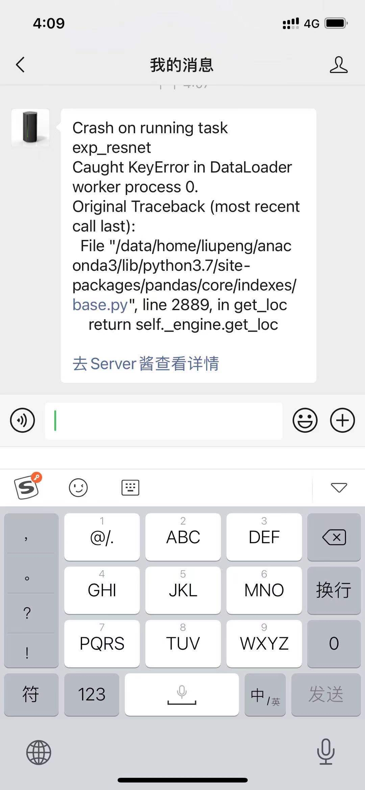

# python-dlcr-framework
A python deep learning configuration and run framework.

##Basic usage
Run example:
```shell
python boot_strap.py --config exp_test/configs/example_test.py
```
add `--gpu ID` to override you gpu setting in the config file, in some case gpu used by others.

e.g. you set `gpu='4,3'` in config file but want to use gpu 6 and 7 to train:
```shell
python boot_strap.py --config exp_test/configs/example_test.py --gpu 6,7
```
## Notifications
When your experiment run into a crash, push a message to your Wechat or other app, e.g. feishu, dingtalk... with third party push service.
> Now only support push service of (https://sct.ftqq.com/sendkey)
1. setup your push service in (https://sct.ftqq.com) and copy token to `boot_strap.py, line 11`, e.g.
```python
sendkey='SCT**************'
```
2. Run push example:
```shell
python boot_strap.py --config exp_test/configs/example_push_service.py --gpu 7 --push_message True
```

Notification example:

